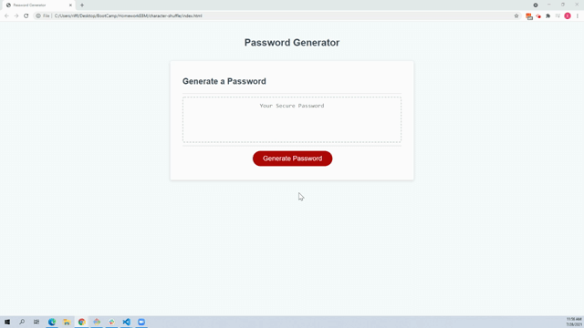

# character-shuffle

This is a random password generator written from a few lines of starter code. It runs on JS functions which prompt the user.

## About

The HTML and CSS for this project was provided for me. I assembled the variables, arrays, and if/else statements.
Click the generate button and follow the prompts in your browser. Refresh to start over.

### Screencast

